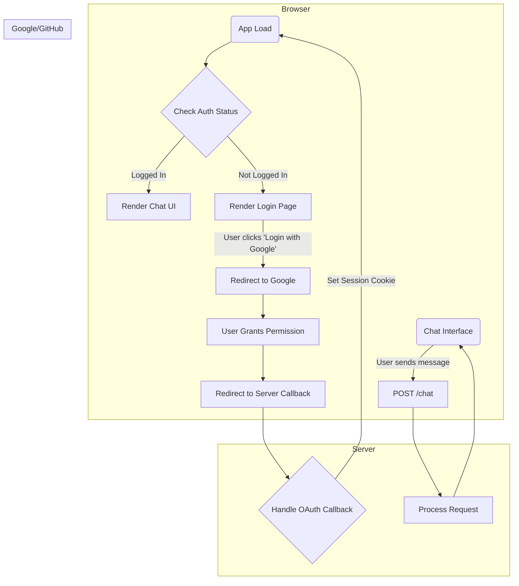

# 🧠 Knowledge Navigator

**AI-Generated Code Disclaimer**: This entire project, including its architecture, backend, frontend, and this documentation, was generated with the assistance of a large language model. It serves as a comprehensive example of a multi-agent system but may require further refinement and security hardening for production use.

## Introduction

Knowledge Navigator is an advanced, AI-powered chat application inspired by Apple's visionary 1987 concept video. It functions as an intelligent assistant that can understand complex queries, formulate a plan, and delegate tasks to a team of specialized AI agents to gather and synthesize information.

The application is built on a modern, robust backend using LangChain.js and LangGraph.js, with a clean, responsive frontend built with React and Vite. It includes a secure user authentication system using OAuth2 for Google and GitHub.

## Architecture Overview

The application follows a client-server model with a clear separation of concerns.

### Backend (Server)

The backend is the core of the application, running a sophisticated multi-agent graph orchestrated by LangGraph.js. This graph uses a Supervisor pattern (also known as a Master Control Program or MCP) to manage the workflow intelligently.

```mermaid
flowchart TD
    subgraph Client
        A[User Action]
    end

    subgraph Server (Node.js/Express)
        B{/chat Endpoint}
        C[ensureAuthenticated Middleware]
        D[LangGraph App]

        subgraph LangGraph Workflow
            E(Planner)
            F(Tool Executor)
            G(Supervisor/MCP)
            H(Responder)
        end
    end

    subgraph External APIs
        I[Google Gemini]
        J[Tavily, GitHub, etc.]
    end

    A --> B
    B --> C
    C -- Authenticated --> D
    C -- Not Authenticated --> Client((401 Error))
    D --> E
    E -- plan --> G
    G -- replan --> E
    G -- execute --> F
    F -- tool_output --> G
    G -- finish --> H
    H -- final_response --> Client((Chat Response))

    E -- LLM Call --> I
    F -- API Call --> J
    G -- LLM Call --> I
    H -- LLM Call --> I
```

* **Planner Agent**: Receives the initial user prompt and creates a single, actionable step.
* **Tool Executor**: A specialized node that executes the planned step by calling the appropriate tool (e.g., making an API call to GitHub or searching the web).
* **Supervisor (MCP)**: After a tool is executed, the Supervisor agent reviews the result. It decides whether the user's query has been answered or if another step is needed.
  * If the task is complete, it routes the data to the Responder.
  * If more work is needed, it sends the process back to the Planner to formulate the next step.
* **Responder Agent**: Once the plan is complete, this agent synthesizes all the gathered information from the previous steps into a single, coherent, user-friendly response.

### Frontend (Client)

The frontend is a modern single-page application (SPA) built with React and Vite. It provides a clean, responsive chat interface where users can interact with the agent. It also handles the user-facing part of the OAuth2 login flow, redirecting users to Google or GitHub for authentication and managing the user's session state.



## Comparison to Model Context Protocol (MCP)

While this application's architecture is philosophically similar to the Model Context Protocol (MCP), it is not a compliant implementation. The project uses the MCP pattern of a supervised agentic workflow but does not adhere to the strict, standardized protocol.

* **Conceptual Alignment (The "Why")**: The architecture is built on the same core principles as MCP. It uses a central, evolving state object (graphState) as the "context" and a supervisor node that acts as the "Master Control Program" to intelligently route tasks between specialized worker agents. This supervised approach is key to building robust and reliable agents, which is the goal of MCP.
* **Implementation Differences (The "How")**:
  * **Pattern vs. Protocol**: This application implements the MCP design pattern in a self-contained way. A true MCP system would adhere to a formal, public protocol, allowing for interoperability. For example, you could swap this project's planner agent with any other MCP-compliant planner, and the system would still function.
  * **Custom Context Object**: The graphState is a custom Javascript object. All agents in this system are tightly coupled to its specific structure (e.g., plan, pastSteps). A compliant system would use a standardized context schema that all agents, regardless of their origin, are programmed to understand.
  * **In-Memory vs. Network Communication**: Communication between agents in this project happens via in-memory function calls managed by the LangGraph runtime. An interoperable protocol like MCP would almost certainly be built on a network layer (e.g., HTTP), where agents are treated as decoupled microservices.

In summary, this project is an excellent example of the kind of application MCP is designed to standardize. It follows the architectural best practices but does so in a custom, monolithic way rather than adhering to a formal, interoperable protocol.

## Features

* **Supervised Multi-Agent System**: A robust LangGraph architecture that prevents loops and handles complex queries.
* **Specialized Tools**: Equipped with a variety of tools to access different information sources:
  * **TavilySearch**: For general, AI-optimized web searches.
  * GitHub: To search for code repositories.
  * Wikipedia: To fetch summaries of articles.
  * ArXiv: To find scientific papers.
  * Open-Meteo: For real-time weather forecasts.
  * File Analyst: To process and answer questions about user-uploaded files.
* **Secure User Authentication**: Enforces user login via OAuth2 with Google and GitHub, managed by Passport.js on the backend.

## 📂 Project Structure

The project is organized as a monorepo with separate directories for the client and server.

```text
knowledge-navigator/
├── client/              # Vite + React Frontend
│   ├── src/
│   │   ├── App.jsx
│   │   ├── Login.jsx
│   │   ├── index.css
│   │   └── Login.css
│   ├── index.html
│   ├── package.json
│   └── vite.config.js
└── server/              # Node.js + LangGraph Backend
    ├── .env
    ├── graph.js
    ├── server.js
    └── package.json
```

## 🛠️ Setup and Installation

### Prerequisites

* Node.js (v18 or higher)
* npm (Bundled with Node.js)

### Backend Setup

Navigate to the server directory:

```bash
cd server
```

Install dependencies:

```bash
npm install
```

### Create and configure the environment file

Create a file named `.env` in the server directory and add the following variables. You must fill in your own credentials from the Google Cloud Console and GitHub OAuth Apps dashboard.

```text
# --- Session Secret ---
# A random, complex string used to secure user sessions.
SESSION_SECRET="YOUR_RANDOM_SESSION_SECRET"

# --- Google OAuth Credentials ---
GOOGLE_CLIENT_ID="YOUR_GOOGLE_CLIENT_ID"
GOOGLE_CLIENT_SECRET="YOUR_GOOGLE_CLIENT_SECRET"

# --- GitHub OAuth Credentials ---
GITHUB_CLIENT_ID="YOUR_GITHUB_CLIENT_ID"
GITHUB_CLIENT_SECRET="YOUR_GITHUB_CLIENT_SECRET"

# --- Model & Tool Keys ---
GOOGLE_API_KEY="YOUR_GOOGLE_GEMINI_API_KEY"
TAVILY_API_KEY="YOUR_TAVILY_API_KEY"
GITHUB_TOKEN="YOUR_GITHUB_PERSONAL_ACCESS_TOKEN" # Optional, for higher API rate limits
```

Please make sure that the .env file is not added to Github or any other VCS public repository.

Run the server:

```bash
node server.js
```

The server will start on <http://localhost:3001>.

### Frontend Setup

Navigate to the client directory:

```bash
cd client
```

Install dependencies:

```bash
npm install
```

Run the client:

```bash
npm run dev
```

The clien will be accessible at <http://localhost:5173>.

Usage

Open your browser and navigate to <http://localhost:5173>.

You will be presented with a login screen. Choose to sign in with either your Google or GitHub account.

After successful authentication, you will be redirected to the main chat interface.

You can now ask the Knowledge Navigator questions, and it will use its team of agents to find the best possible answer.
